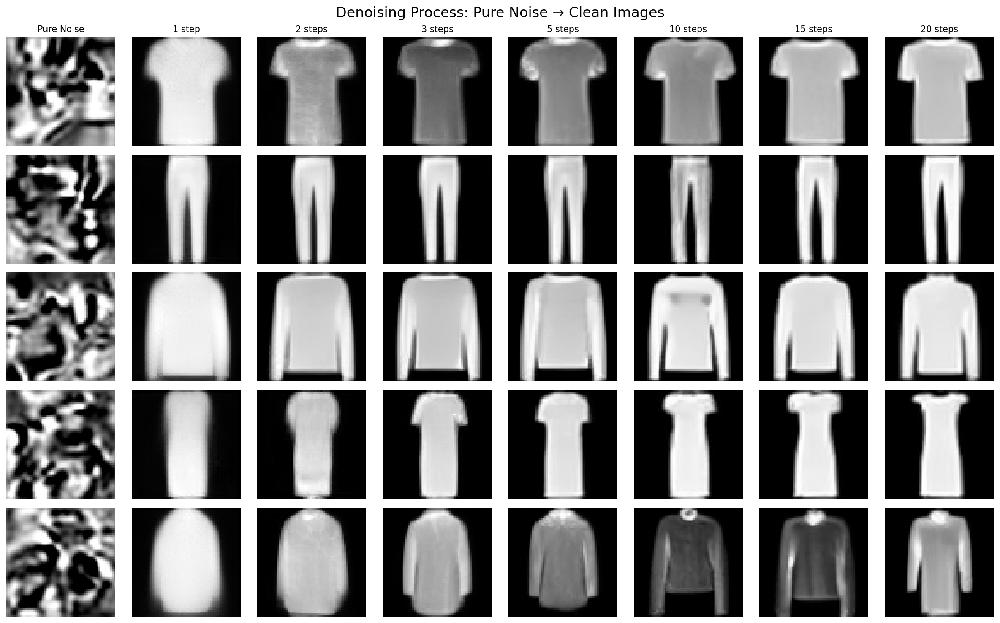
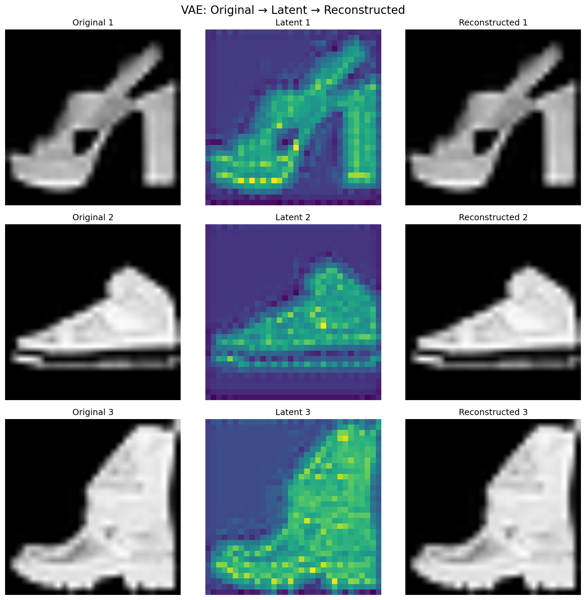
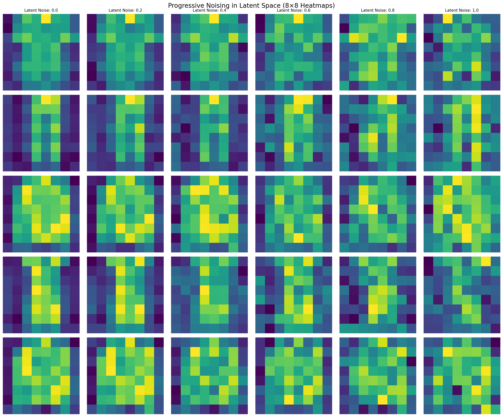
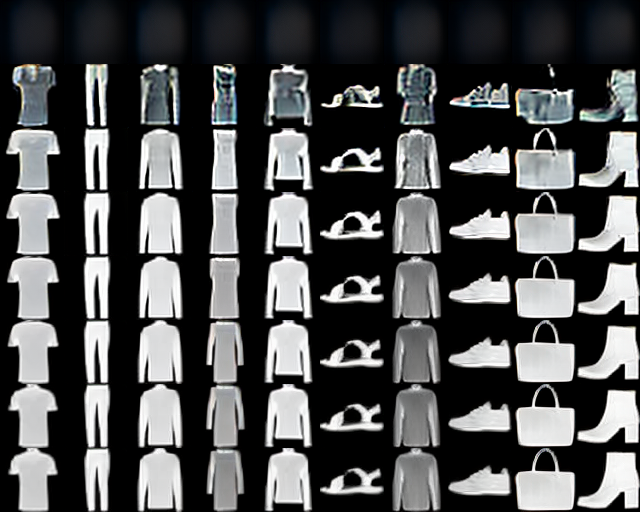
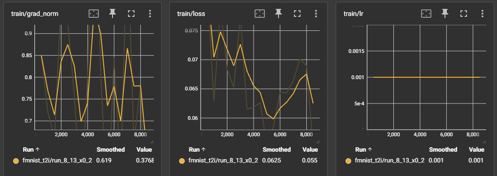

# FMNIST Text-to-Image Transformer Latent Diffusion

A Text-to-Image Transformer Latent Diffusion model for Fashion MNIST, featuring transformer architecture with cross-attention mechanisms, continuous timesteps, and VAE latent space training.

## Project Overview

This project implements a transformer-based diffusion model for text-to-image generation. The model progressively refines noise into Fashion MNIST images through a series of denoising steps, conditioned on text labels.


*Each frame shows a different random seed, for 8500th step. Classes are arranged left-to-right: T-shirt/top, Trouser, Pullover, Dress, Coat, Sandal, Shirt, Sneaker, Bag, Ankle boot.*

## Key Features

- Transformer-based model with cross-attention for text conditioning
- FlashAttention support for faster training and inference
- Continuous timesteps using noise levels
- Flexible text encoding (one-hot, learned, pretrained)
- VAE integration for efficient latent space training
- TensorBoard logging and checkpointing
- Memory-efficient datasets with memory mapping
- Optional torch.compile() support
- Classifier-free guidance support

## Quick Start

### Installation
```bash
pip install -r requirements.txt
```

### Data Preparation
```bash
python data_prep.py --output-dir dataset/fmnist
```

**Output**: The script converts 64×64 FMNIST images to 8×8×4 VAE latents, significantly reducing memory usage while maintaining image quality.

### Training
```bash
python main.py
```

### Pre-trained Models & Data
- **Model Weights**: [Hugging Face Model Repository](https://huggingface.co/shreenithi20/fmnist-t2i-diffusion)
- **Pre-computed Latents**: [Hugging Face Dataset Repository](https://huggingface.co/datasets/shreenithi20/fmnist-8x8-latents)

## Usage Examples

### Custom Configuration
```bash
python main.py \
    --batch-size 64 \
    --lr 2e-3 \
    --total-steps 2000 \
    --embed-dim 512 \
    --n-layers 16 \
    --text-encoding learned \
    --compile
```

### Python API
```python
from fmnist_t2i import T2IConfig, FMNISTT2ITrainer

cfg = T2IConfig(
    latent_path="dataset/fmnist/image_latents.npy",
    text_emb_path="dataset/fmnist/label_encodings.npy",
    lr=1e-3,
    batch_size=128,
    total_steps=8500
)

trainer = FMNISTT2ITrainer(cfg)
trainer.train()
```

## Technical Details

### Model Architecture
- Patch-based processing with 8×8 latent patches
- Multi-layer transformer decoder with self-attention and cross-attention
- Sinusoidal positional encoding for continuous timesteps
- Cross-attention mechanisms for text conditioning

**Architecture Specifications**
- Default embedding dimension: 384
- Default layers: 12
- Default attention heads: 6 (auto-calculated as embed_dim // 64)
- MLP multiplier: 4
- Patch size: 1×1 (each latent pixel becomes a token)
- Total parameters: ~15M (configurable)

**FlashAttention Integration**
The model automatically uses FlashAttention when available, providing significant speed and memory improvements:

- **Performance**: 2-4x faster attention computation on modern GPUs
- **Memory Efficiency**: O(N) memory complexity vs O(N²) for standard attention
- **Automatic Fallback**: Gracefully falls back to standard attention if FlashAttention unavailable
- **Requirements**: CUDA GPU + `flash-attn>=2.0.0` package
- **Compatibility**: Works with all attention mechanisms (self-attention, cross-attention)

### Pre-trained Models
Model weights available on [Hugging Face](https://huggingface.co/shreenithi20/fmnist-t2i-diffusion). Base model: 384 dim, 12 layers, ~28M params.

### Diffusion Process
- Continuous noise sampling from beta distribution
- Progressive denoising with configurable inference steps
- VAE integration for latent-pixel space conversion


*Step-by-step denoising process showing progressive refinement from noise to clear images*

### VAE Integration
The model operates in VAE latent space for efficiency. Images are compressed to 8×8×4 latent representations, reducing memory usage and training time while maintaining quality.

**Why Pre-compute Latents?**
Instead of encoding images to VAE latents during training, we pre-compute all latents offline. This approach offers several advantages:

- **Training Speed**: Eliminates VAE encoding overhead during each training iteration
- **Memory Efficiency**: Pre-computed latents are much smaller (8×8×4 vs 64×64×3) and can be memory-mapped
- **Consistency**: Ensures all training samples use identical VAE encoding, avoiding potential variations
- **Scalability**: Allows training on larger datasets without GPU memory constraints from VAE encoding
- **Reproducibility**: Same latent representations across different training runs

The trade-off is increased disk storage and initial preprocessing time, but the training efficiency gains are substantial.

**VAE Configuration**
- Model: `stabilityai/sd-vae-ft-mse`
- Latent scale factor: 0.18215
- Input resolution: 64×64×3 (FMNIST images resized to 64×64)
- **Saved latent resolution: 8×8×4** (VAE compresses 64×64 images to 8×8 latents)
- Compression ratio: 64:1 (64×64×3 → 8×8×4)


*VAE compression analysis showing the trade-off between image quality and latent space efficiency*


*Visualization of noise effects on VAE latent representations*

### Noise Scheduling
The model uses continuous timesteps with beta distribution sampling for smooth noise levels, allowing for fine-grained control over the denoising process.

**Continuous vs Discrete Timesteps**
Unlike traditional diffusion models that use discrete timesteps (e.g., 1000 steps), this model samples noise levels continuously from a beta distribution. This provides several advantages:

- **Smooth transitions**: Continuous noise levels create smoother denoising trajectories
- **Flexible inference**: Can use any number of inference steps without retraining
- **Better coverage**: Beta distribution ensures noise levels are well-distributed across the range

**Beta Distribution Parameters**
The noise level `t` is sampled from Beta(β_a, β_b) where:
- β_a = 1.0: Controls the shape of the distribution
- β_b = 2.5: Creates a distribution that favors lower noise levels
- Noise range: 0.01 to 0.99 (1% to 99% noise)

**Inference Configuration**
- Default inference steps: 25
- Noise start: 0.99
- Noise end: 0.01
- Linear interpolation between noise levels


*Comparison of different noise levels and their effects on image quality*

### Loss Function
The model uses a simple but effective loss function based on the diffusion process:

**MSE Loss on Clean Predictions**
```
Loss = MSE(predicted_clean_image, target_clean_image)
```

**Training Process**
1. Sample a batch of latent images and add random noise levels
2. Model predicts the clean image at each noise level
3. Loss is computed between predictions and original clean images
4. Gradients are backpropagated to update model parameters

This approach is simpler than traditional diffusion models that predict noise residuals, making training more stable and interpretable.

### Training Features
- Gradient accumulation for large effective batch sizes
- Automatic mixed precision training
- Exponential moving average updates
- Robust checkpoint saving and resuming

**Training Configuration**
- Default learning rate: 1e-3
- Optimizer: AdamW with weight decay 0.01
- Scheduler: None (constant learning rate)
- Gradient clipping: 1.0
- Mixed precision: Enabled by default
- Gradient accumulation: 2 steps by default

### EMA Model
The training uses an Exponential Moving Average (EMA) model alongside the main model. The EMA model maintains a smoothed version of the model parameters, updated at each training step:

```
EMA_params = decay × EMA_params + (1 - decay) × current_params
```

**Why EMA for Diffusion Models?**
- **Stability**: EMA models produce more consistent and stable generations
- **Quality**: Averaged parameters reduce noise and improve image quality
- **Convergence**: Helps with training stability, especially important for diffusion models
- **Inference**: The EMA model is typically used for generation, not the training model

The default decay rate is 0.999, meaning each parameter update contributes only 0.1% to the EMA, creating a very stable moving average.

### Text Conditioning
The model supports multiple text encoding strategies for conditioning:

**One-Hot Encoding (Default)**
- 10-dimensional vectors for Fashion MNIST classes
- Simple and effective for categorical data
- No learned parameters needed

**Cross-Attention Mechanism**
- Text tokens attend to image patches
- Enables fine-grained text-image alignment
- Separate attention heads for cross-attention

### Memory Management
**Dataset Memory Mapping**
- Latents and text embeddings stored as memory-mapped files
- Reduces RAM usage for large datasets
- Enables training on datasets larger than available memory

**Gradient Accumulation**
- Effective batch size = batch_size × accumulation_steps
- Allows training with large effective batches on limited hardware
- Default: 128 × 2 = 256 effective batch size

**Mixed Precision Training**
- Automatic mixed precision (AMP) enabled by default
- Reduces memory usage and speeds up training
- Configurable precision (float16, bfloat16)

## Results

The model achieves high-quality Fashion MNIST generation with 25 inference steps for production-quality images.

**Generation Quality**
- Consistent class separation across all 10 categories
- Smooth denoising with progressive detail refinement
- High fidelity to Fashion MNIST style and structure
- Fast inference: ~1 second for 25 steps on modern GPU


*Complete 8×10 grid of Fashion MNIST classes generated in 25 denoising steps (seed 32) for every 1000th step EMA checkpoint.*

### Training Logs

*Training progress over 8,500 steps showing loss convergence, gradient norm stability, and constant learning rate*

## Project Structure

```
├── __init__.py          # Package initialization
├── configs.py           # Configuration classes (T2IConfig)
├── models.py            # Neural network models (FMNISTT2IModel)
├── attention.py         # Attention mechanisms
├── data.py              # Dataset and data loading
├── data_prep.py         # Data preparation (FMNIST 64×64 → VAE 8×8 latents)
├── diffusion.py         # Diffusion sampling and generation
├── trainer.py           # Training loop and validation
├── utils.py             # Utility functions
├── main.py              # Main training script
├── requirements.txt     # Dependencies
├── README.md            # This file
```

## Dependencies

- PyTorch >= 1.12
- torchvision
- numpy
- tqdm
- tensorboard
- safetensors
- diffusers
- **flash-attn >= 2.0.0 (optional, for FlashAttention acceleration)**

**FlashAttention Installation**
```bash
# For CUDA 11.8
pip install flash-attn --no-build-isolation

# For CUDA 12.1
pip install flash-attn --no-build-isolation

# Or install from source for custom CUDA versions
git clone https://github.com/Dao-AILab/flash-attention
cd flash-attention && pip install .
```

**Note**: FlashAttention requires a CUDA-capable GPU and compatible CUDA version. The model will automatically fall back to standard attention if FlashAttention is not available.

## License

MIT License

## Contributing

Issues and pull requests are welcome.